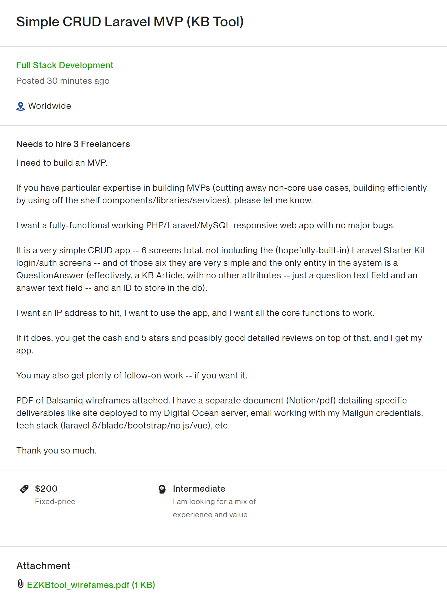
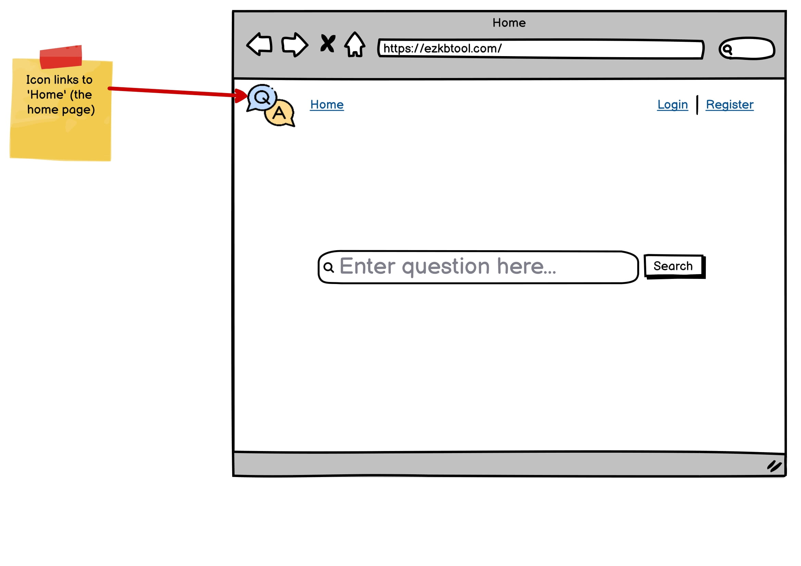
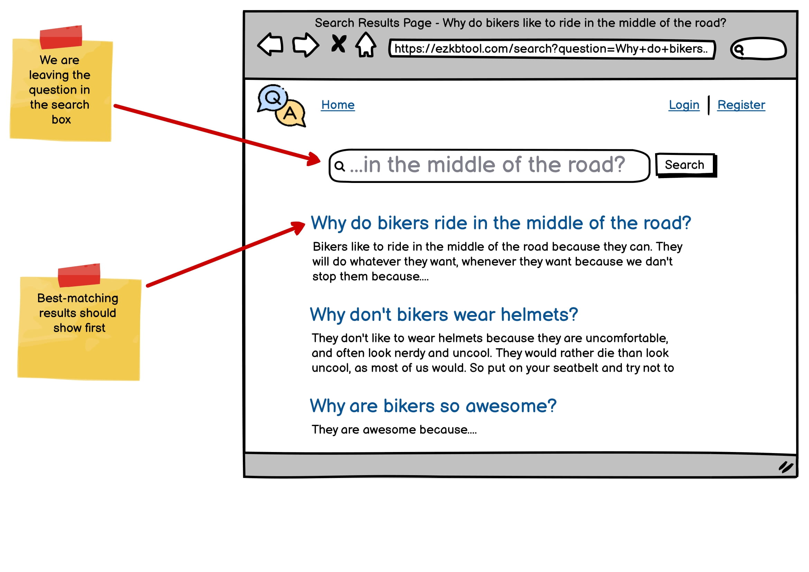
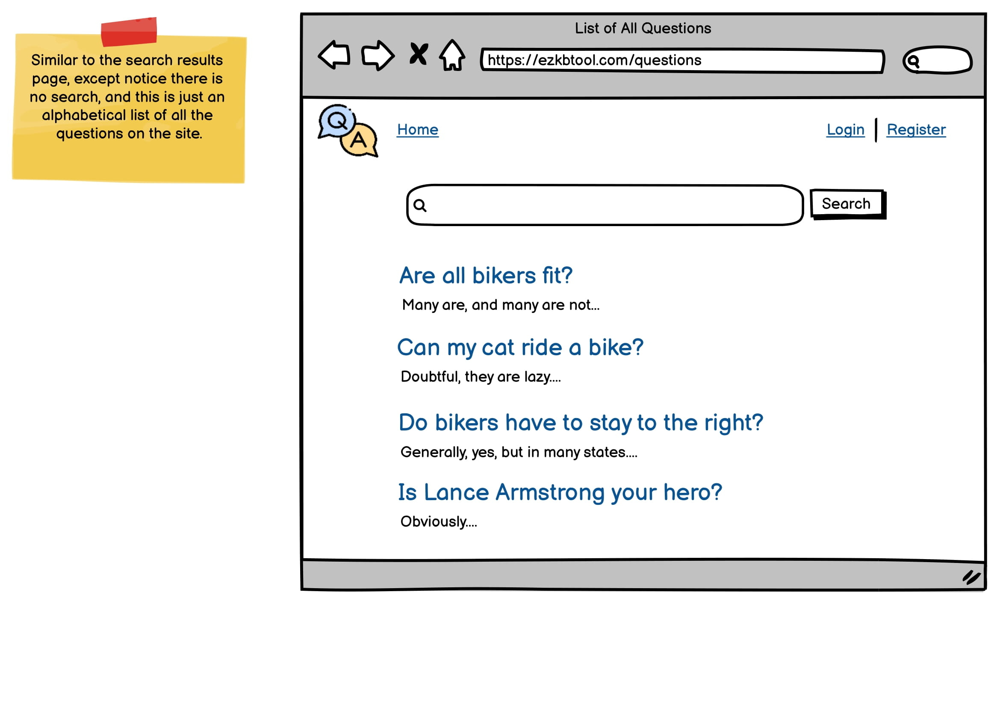
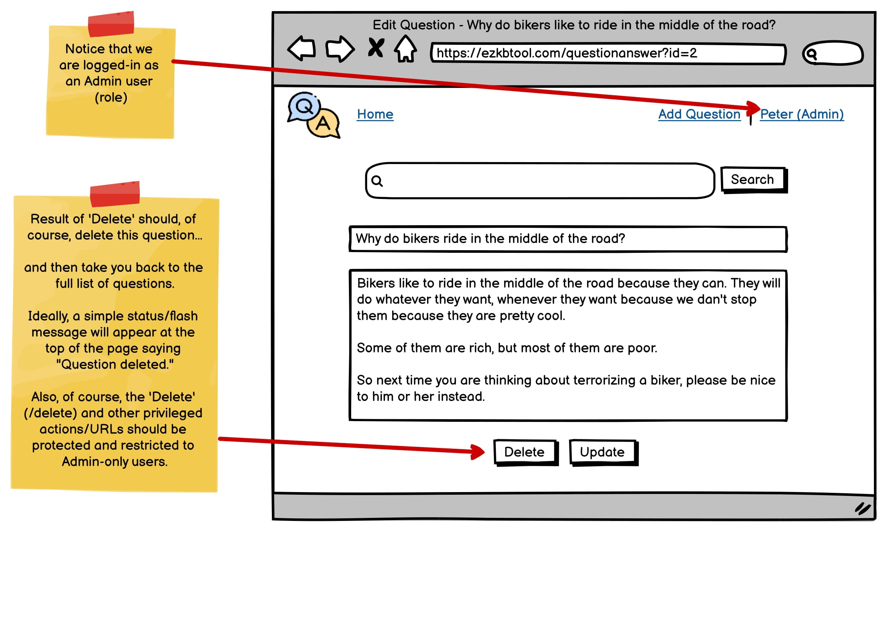
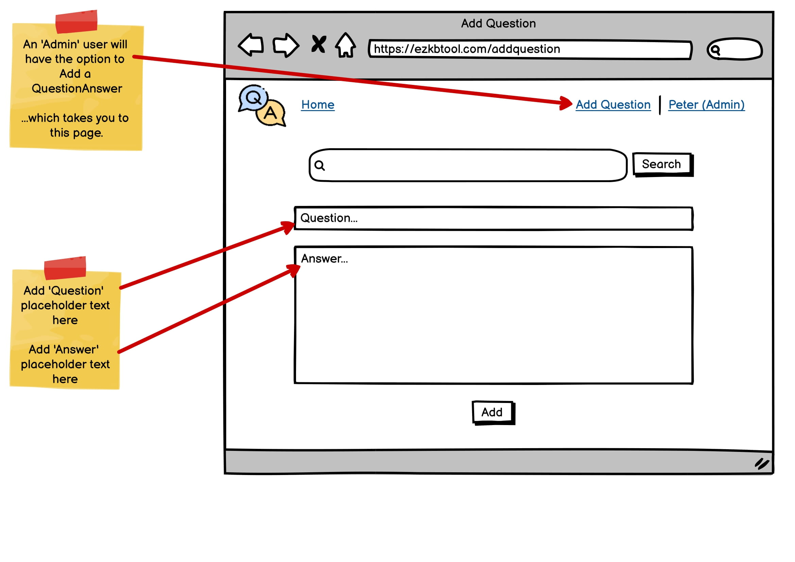
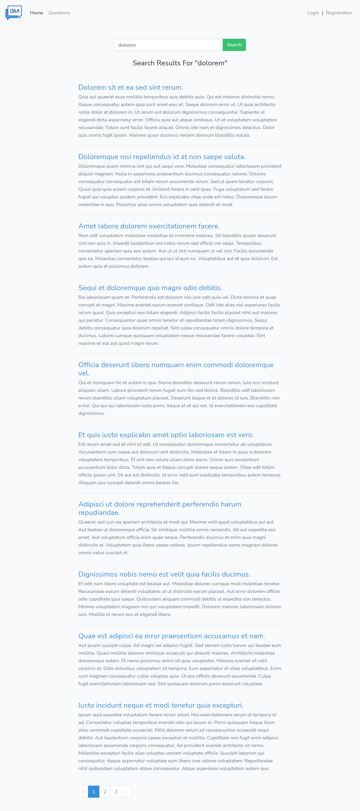
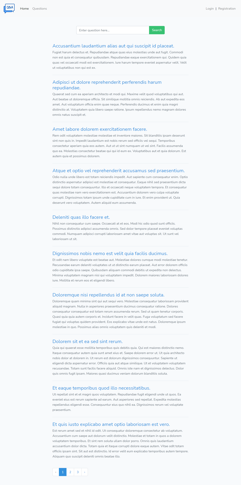
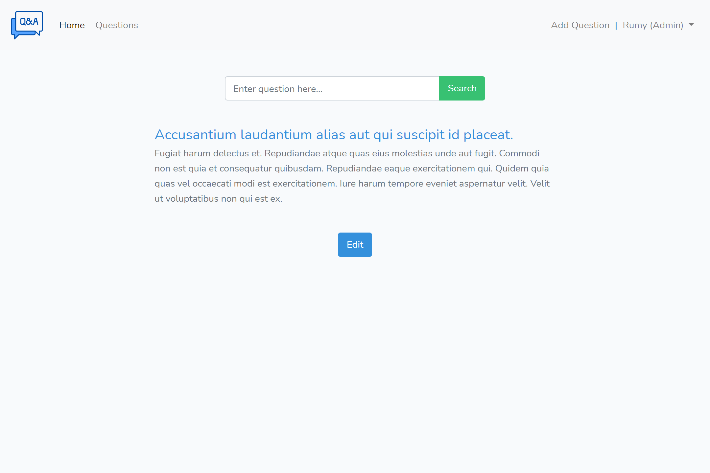
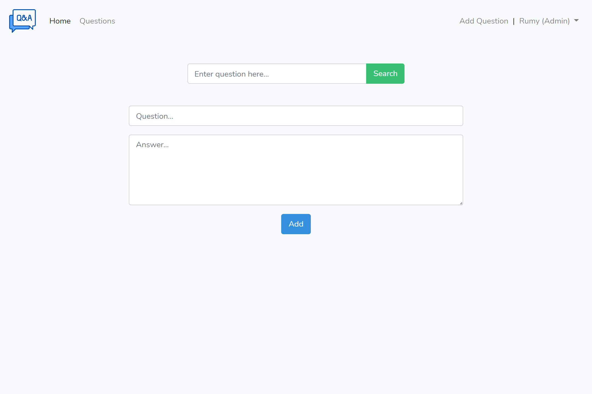

# KB Tool

Knowledge Base question answer searching website. Based on Laravel 8.X. For searching, I have used MySQL full-text indexing and searching.

I saw a job post on UPWORK and thought I should try it for fun. The job description is given below.

## Screenshot of Job Details



## Screenshots of PDF pages








## Requirements

- Laravel 8.X
- \>= PHP 7.3

## Installation

```
git clone https://github.com/rumyTM/kbtool.git
cd kbtool
composer install
cp .env.example .env
php artisan key:generate
php artisan migrate --seed
```

## Screenshots of the Website











